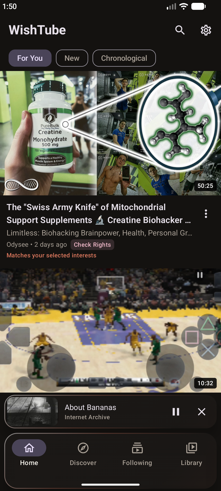
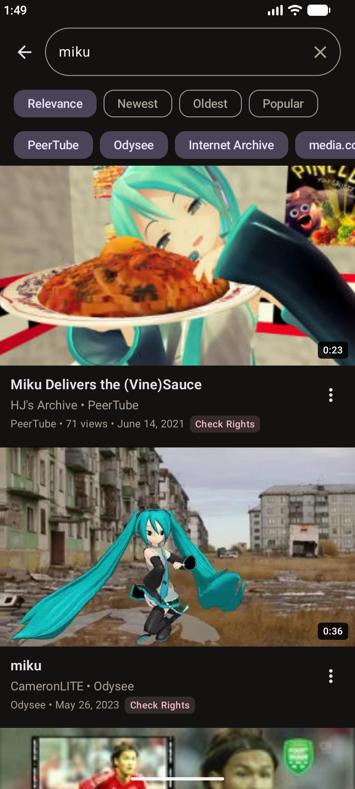
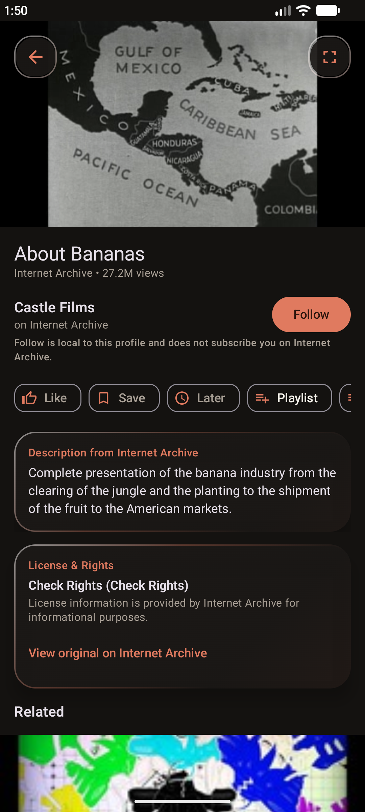
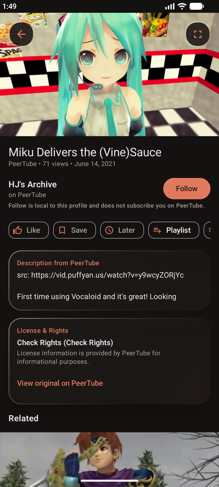
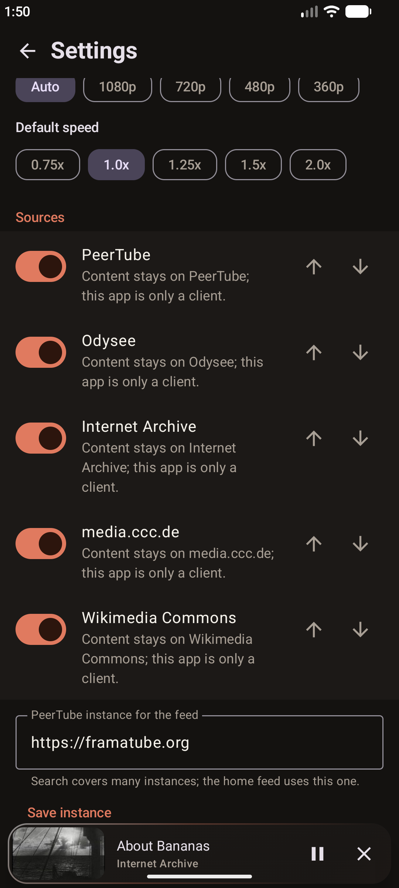

<p align="center">
  
</p>

<h1 align="center">WishTube</h1>

<p align="center">
  <b>One app for open video. No account, no tracking, no cloud.</b>
</p>

<p align="center">
  
  
  
  
  
</p>

<p align="center">
  <a href="#screenshots">Screenshots</a> ·
  <a href="#features">Features</a> ·
  <a href="#supported-sources">Sources</a> ·
  <a href="#privacy">Privacy</a> ·
  <a href="#build-it">Build</a> ·
  <a href="#license-and-disclaimer">License</a>
</p>

---

> **WishTube** is a local-first Android media client. It pulls **PeerTube, Odysee, Internet Archive, media.ccc.de and Wikimedia Commons** into one cozy, warm, liquid-glass interface. Search everything at once, watch it, save it. Your profile, history, playlists and notes never leave your phone.

---

## Screenshots

<table align="center">
  <tr>
    <td align="center"></td>
    <td align="center"></td>
    <td align="center"></td>
    <td align="center"></td>
    <td align="center"></td>
  </tr>
  <tr>
    <td align="center"><b>Home</b></td>
    <td align="center"><b>Search</b></td>
    <td align="center"><b>Video</b></td>
    <td align="center"><b>Player</b></td>
    <td align="center"><b>Sources</b></td>
  </tr>
</table>

---

## Features

| Feature | What you get |
| --- | --- |
| **Unified search** | One query goes to every enabled source in parallel. Results appear progressively, each with a provider badge. |
| **License-aware** | Videos are tagged by license (Public Domain, CC0, CC BY, CC BY-SA) and reuse status (Remixable, Check Rights, Restricted). |
| **Solid playback** | AndroidX Media3 (ExoPlayer) with HLS and DASH, automatic stream fallback, subtitles, Picture-in-Picture and background playback. |
| **Local library** | Watch Later, Saved, Liked, private notes and multi-source playlists. Export or import your profile as JSON. |
| **Your sources** | Reorder them, switch them on or off, or add your own PeerTube instances in Settings. |
| **Liquid glass UI** | Frosted gradients, refraction borders, soft shadows and a warm palette of cream, terracotta, sage and coffee brown. |

---

## Supported sources

| Source | What WishTube uses it for |
| --- | --- |
| **PeerTube** | Parallel feeds from multiple instances, plus SepiaSearch |
| **Odysee** | JSON-RPC claim search and stream URL resolution |
| **Internet Archive** | Cached, paginated video archives |
| **media.ccc.de** | Conference recordings and lectures |
| **Wikimedia Commons** | Educational and media-repository videos |

---

## Privacy

- No account, no sign-in
- No analytics, no tracking
- No WishTube server. Everything is stored on your device
- The app only talks to the video sources you have enabled, to search and stream

---

## Build it

1. Open this folder in **Android Studio** (Ladybug or newer, JDK 17).
2. Let Gradle sync (the Gradle 8.9 wrapper is included).
3. Run the `app` configuration on a device or emulator (**Android 8.0+ / API 26+**).

Or from the command line:

```bash
./gradlew assembleDebug
```

<details>
<summary><b>Built with</b></summary>

<br>

| Part | Tech |
| --- | --- |
| UI | Jetpack Compose, Material 3, Material Symbols Rounded |
| Playback | AndroidX Media3 (ExoPlayer + OkHttp DataSource) |
| Database | Room |
| Networking | OkHttp + kotlinx.serialization |
| Images | Coil |

</details>

---

## Contributing

Found a bug or want a source added? Open an issue at [github.com/wishissue/wishtube/issues](https://github.com/wishissue/wishtube/issues).

---

## License and disclaimer

WishTube is released under the **Apache License 2.0**. See [THIRD_PARTY_LICENSES.md](THIRD_PARTY_LICENSES.md) for third-party notices and [OPEN_SOURCE_SOURCES.md](OPEN_SOURCE_SOURCES.md) for the sources list.

> *WishTube is an independent open-source media client. It is not affiliated with, endorsed by, or sponsored by any of the platforms or content providers it connects to.*
